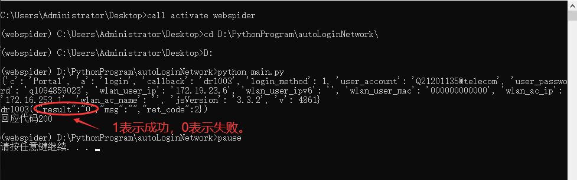

# 向某ip发送get请求
> 基于python,简易的向某ip发送get请求，可用于 安徽大学 校园网登录
# 用户配置
userData.json中配置
- user_account:"账户名"
- user_password:"密码"
# 使用
AutoConnect.bat 是一个简单的bat脚本，用于在windows下方便使用，仅供参考

返回信息中result为1表示成功，0表示失败